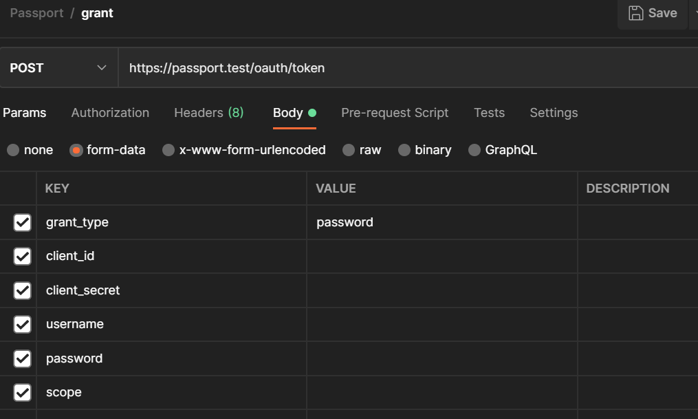

### LDAP PASSPORT

```
php artisan migrate

php artisan passport:install
php artisan passport:client --password
```

Which user provider should this client use to retrieve users? [users]:
  [0] users
  [1] ldap 

Select option 1.

I send the following parameters to generate the token



- I am trying to integrate ldaprecord and laravel passport
- The personal Access Token already works. in the following path:
```
/api/v1/login
```
- But when wanting to create Password Grant Client, in the path:
 ```
/oauth/token
```
it throws the following error

```json
{
    "error": "invalid_grant",
    "error_description": "The provided authorization grant (e.g., authorization code, resource owner credentials) or refresh token is invalid, expired, revoked, does not match the redirection URI used in the authorization request, or was issued to another client.",
    "hint": "",
    "message": "The provided authorization grant (e.g., authorization code, resource owner credentials) or refresh token is invalid, expired, revoked, does not match the redirection URI used in the authorization request, or was issued to another client."
}
```